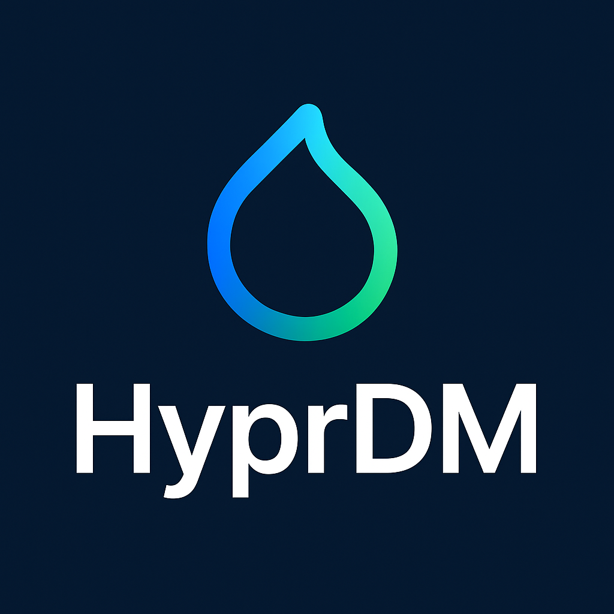

# Introduction
**hyprdm**, or **Hyprland Display Manager**, is a dynamic display manager developed for **Hyprland Tiling Window Management**, providing customization and integration for Hyprland.





## Features
- HOTP and TOTP support for user login, PAM, and 2FA.
- Customization based on Qt QuickShell patches or configurations.
- Thanks to the backend system, we now have **Rust** and **C++** support for developing graphical interfaces.
- **Theme Manager support:** Full support for GTK and Qt themes, including custom theme support.
- With **sessiondm**, you can use Hyprland Display Manager as a session-based login manager.
- Manage full window settings with the layout manager.

In short, we support many integrations and features that carry DM functionality, and we plan to offer more advanced security and integration support in the future.

# Installation

If you want to compile directly with Cargo:

```bash
cd gui-api
cargo build --release
```
If you want to compile the Rust backend FFI library:
```
HDM_API_LIB_TYPE=c cargo build --release --no-default-features
```
If you want to compile the Rust backend library directly:
```
HDM_API_LIB_TYPE=rust cargo build --release
```
or if you want to install directly:
```
./build.sh
```
If you want to install the HyprDM-greeterd:

```bash
cd gui-api/greeterd
bash autogen.sh
````

If you're building with Makefile:

```bash
make
```

If you're building with CMakeLists.txt:

```bash
mkdir build
cd build
cmake ../
```

The GUI interfaces are developed by HyprCommunity. Narval interfaces are distributed under the BSD3 "Claude" license. The interface includes various features, but it's currently under development and will be available soon.


Hyproman interface:


